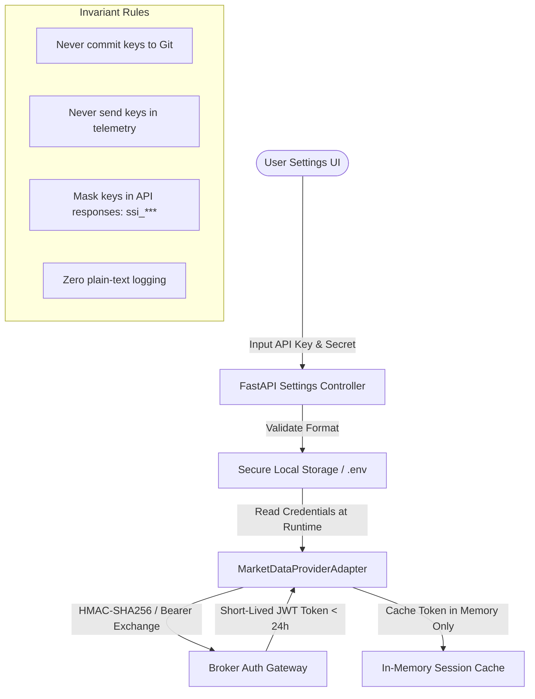
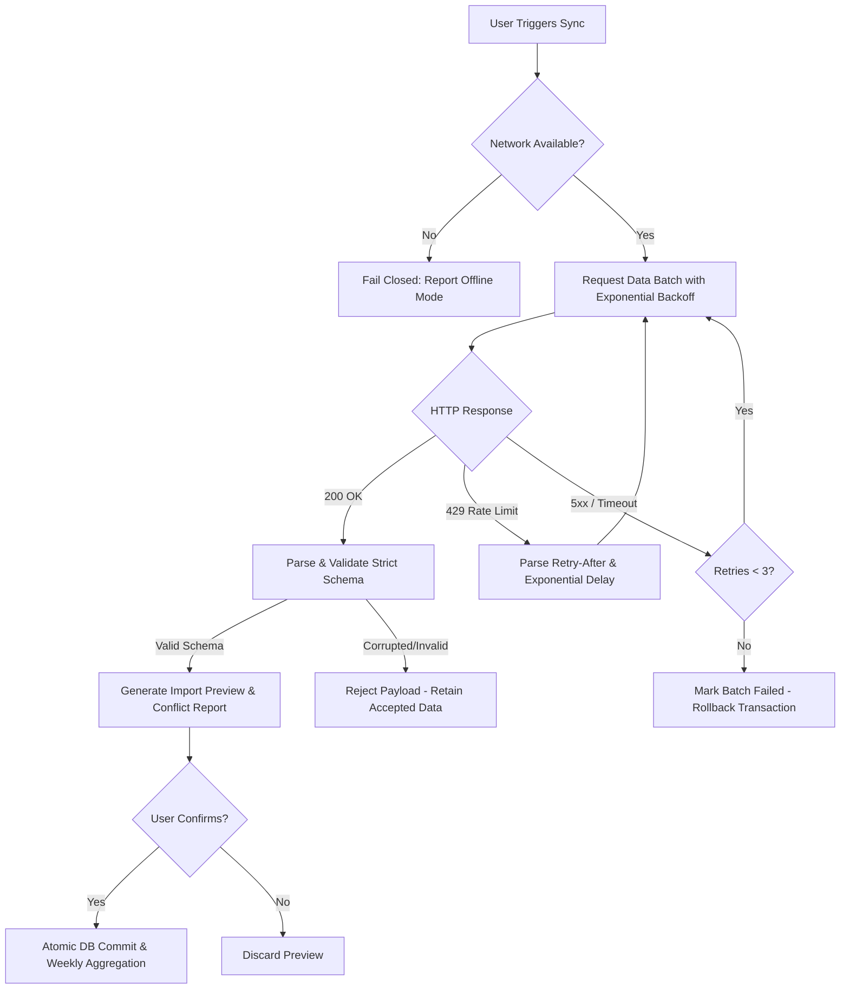

# ADR-002 — Market Data Provider Architecture & Selection Decision

- **Status**: Approved (Unlocks PRO-11 One-Click Data Sync under Provider Boundary Adapter)
- **Date**: 2026-08-16
- **Decision Owner**: Product Reviewer / System Architect
- **Authority**: `docs/SUMI_PROFESSIONALIZATION_MASTER_PLAN_2026-07-31.md`, `docs/program/PRO_10_MARKET_DATA_PROVIDER_DECISION.md`
- **Acceptance IDs**: `PRO-PROV-01`, `PRO-PROV-02`, `PRO-PROV-03`, `PRO-PROV-04`, `PRO-PROV-05`, `PRO-PROV-06`

---

## 1. Context and Problem Statement

Sumi is a local-first desktop application engineered for serious technical analysis and manual replay backtesting on Vietnam equities. In PRO-03 (`docs/program/PRO_03_DATA_CATALOG_AND_IMPORT_QUALITY.md`), Sumi established a rock-solid, fail-closed offline data catalog and file import engine (`CafeFImporter`, `ImportClassifier`, `WeeklyAggregator`) with immutable audit trails, duplicate/conflict classification, and transactional rollback.

While manual file imports (CSV/ZIP from CafeF or local directories) provide 100% offline autonomy, traders require a streamlined, reliable, and secure method to synchronize end-of-day (EOD) and historical Daily candles directly without navigating manual download sites.

However, integrating external network APIs poses significant architectural, legal, privacy, and stability risks:
1. **Local-First Privacy Invariant**: Sumi must never transmit user trading data, journal notes, strategies, or replay states to any remote server (zero telemetry).
2. **Legal & Licensing Compliance**: Many financial data feeds prohibit automated redistribution, reverse-engineering, or commercial embedding without formal agreements.
3. **Data Quality & Corporate Action Integrity**: Vietnam equity data requires precise dividend/split adjustments, exact Monday–Friday trading calendars, and deterministic UTC+7 timestamp handling.
4. **Third-Party API Volatility**: Unofficial endpoints or scraping libraries frequently break, change JSON schemas, or get blocked by Cloudflare/WAF protections.
5. **Architectural Boundary Isolation**: Third-party DTOs, network clients, or scraping dependencies must never leak into Sumi's authoritative domain layer (`Candle`, `IndicatorEngine`, `ReplayService`, `WeeklyAggregator`).

This Architectural Decision Record (ADR) provides the exhaustive evaluation spike required by PRO-10, comparing all major Vietnam market data provider candidates across licensing, security, historical depth, corporate actions, failure resilience, and local-first compliance, delivering a definitive decision verdict and boundary contract for PRO-11.

---

## 2. Evaluated Candidate Survey

We evaluated six primary market data integration options for Vietnam equity markets (HOSE, HNX, UPCOM):

### 2.1 Candidate A: SSI FastConnect / Open API (SSI Securities Corporation)
- **Nature**: Official Broker REST & WebSocket Open API for authenticated retail/institutional clients.
- **Provider**: SSI Securities Corporation (Công ty Cổ phần Chứng khoán SSI — top-tier market share broker on HOSE).
- **Protocol**: HTTPS REST API (`https://fc-data.ssi.com.vn/api/v2/Market/...`) + WSS Streaming (`/v2.0/streaming`).
- **Auth**: Asymmetric RSA/ECDSA signing or Consumer ID + Consumer Secret + JWT Bearer token exchange.
- **Primary Data**: Daily OHLCV, Intraday 1m/5m/15m/1h bars, Realtime quotes, Corporate Actions / Events, Index components (VN30, VNINDEX, HNX30).

### 2.2 Candidate B: DNSE Open API / Entrade X (DNSE Securities Corporation)
- **Nature**: Official Broker REST & WebSocket Open API for retail developers and automated trading clients.
- **Provider**: DNSE Securities (Công ty Cổ phần Chứng khoán DNSE / Enigma Tech).
- **Protocol**: HTTPS REST API (`https://services.entrade.com.vn/chart-api/...` / `https://openapi.dnse.com.vn/...`).
- **Auth**: API Key / User Token + OAuth2 Bearer token.
- **Primary Data**: Historical Daily/Intraday OHLCV bars, Tick data, Index feeds, Market Depth.

### 2.3 Candidate C: TCBS Public & Web Endpoints (Techcom Securities)
- **Nature**: Internal backend APIs powering the TCInvest web and mobile trading platforms (`apipub.tcbs.com.vn`, `tcanalysis.tcbs.com.vn`).
- **Provider**: Techcom Securities (TCBS).
- **Protocol**: Unofficial HTTPS JSON endpoints.
- **Auth**: None for basic historical bars / Session JWT for advanced screening.
- **Primary Data**: Daily bars, ticker overview, financial statements, valuation ratios.

### 2.4 Candidate D: `vnstock` / `vnstock3` (Open-Source Community Aggregator)
- **Nature**: Python wrapper library aggregating data across multiple unofficial sources (TCBS, SSI public feeds, Vietstock web endpoints, KBSV, MSN).
- **License**: MIT License.
- **Protocol**: High-level Python functions (`stock_historical_data`, `company_overview`).
- **Auth**: Handles internal scraping headers and transient session tokens automatically.

### 2.5 Candidate E: Commercial Institutional Data Vendors (Vietstock Finance, FiinPro, FireAnt)
- **Nature**: Enterprise commercial financial data feeds with dedicated SLAs.
- **Providers**: Vietstock (Tài Việt), FiinGroup (FiinPro Platform), FireAnt (Dữ liệu Tài chính FireAnt).
- **Protocol**: Proprietary REST APIs / SFTP batch exports / WebSocket enterprise feeds.
- **Auth**: Enterprise API Key / IP whitelisting / Commercial license certificates.
- **Pricing**: Paid subscriptions ranging from 5,000,000 VND/year to >100,000,000 VND/year.

### 2.6 Candidate F: Local-First File Imports (CafeF / CSV / ZIP Archives — PRO-03 Baseline)
- **Nature**: Offline file parser and import workflow engine (`CafeFImporter`, `WeeklyAggregator`).
- **Provider**: CafeF EOD ZIP/CSV downloads and user local files.
- **Protocol**: 100% offline local file processing.
- **Auth**: None (local file system).

---

## 3. Deep-Dive Dimension Analysis

### 3.1 Licensing, Terms of Service, Redistribution & Attribution (`PRO-PROV-01`)

| Candidate | Legal Status & Terms | Commercial Redistribution | Personal / Desktop Use | Attribution Requirement |
| :--- | :--- | :--- | :--- | :--- |
| **SSI FastConnect** | Official Broker API terms. Requires client account or developer registration. | Prohibited without exchange data redistribution license from HOSE/HNX. | **Permitted** for personal research, charting, and trading automation by account holder. | "Data provided by SSI FastConnect API". |
| **DNSE Open API** | Official Developer API terms. Requires developer token. | Prohibited for commercial data resale. | **Permitted** for personal and algorithmic use by account holder. | "Data provided by DNSE Open API". |
| **TCBS Web Endpoints** | Unofficial / Reverse-Engineered. TCBS TOS explicitly prohibits automated scraping and non-UI access. | **Prohibited**; high risk of legal cease & desist or IP blacklisting. | **Uncertain / High Risk**; no official developer contract. | N/A (Unofficial). |
| **`vnstock` Library** | MIT License for python code, but upstream data originates from broker web endpoints. | **Prohibited** to resell or guarantee upstream broker data. | **Permitted for personal research**, but subject to upstream endpoint terms. | "Powered by vnstock community open-source". |
| **Commercial Vendors (Vietstock/FiinPro)** | Commercial B2B contract with strict SLA and legally binding data rights. | Permitted only under expensive redistribution enterprise tier (> $2,000/mo). | Requires paid individual subscription; cost prohibitive for standard desktop users. | Mandatory vendor watermark & copyright notice. |
| **CafeF File Import (Baseline)** | Public historical end-of-day data archives for personal analysis. | Permitted for personal local analysis. | **Permitted & Unrestricted** for local-first storage. | "Source: CafeF EOD Archive". |

**Finding**: Sumi cannot bundle proprietary paid enterprise APIs (Candidate E) due to prohibitive recurring costs for a local desktop tool, nor can it legally rely on scraped TCBS endpoints (Candidate C) as an official system warranty. The legally compliant, robust architecture is a **dual-layer model**:
1. **Tier 1 (Official Broker Adapter)**: Support official broker Open APIs (SSI FastConnect, DNSE) where users provide their own personal API credentials.
2. **Tier 2 (Community Fallback Adapter)**: Provide a sandboxed community adapter (`vnstock`) for personal research without hardcoded dependencies in core domain code.
3. **Tier 3 (Local Offline Authority)**: Retain local file import (CafeF/CSV) as the permanent zero-network fallback baseline.

---

### 3.2 Authentication, Credential Storage & Secret Lifecycle (`PRO-PROV-02`)

Security of financial API credentials is a non-negotiable invariant. Sumi must guarantee that API keys, consumer secrets, and private keys are never exposed, logged, or transmitted externally.



#### Secret Storage & Lifecycle Rules:
1. **Storage Mechanism**: API keys, Consumer Secrets, and Private Key paths must be stored in:
   - User-controlled environment variables (`SUMI_DATA_PROVIDER_KEY`, `SUMI_DATA_PROVIDER_SECRET`); or
   - An encrypted local SQLite config table or `.env.local` file located strictly on the local machine and explicitly ignored by `.gitignore`.
2. **Zero Hardcoded Secrets**: Absolutely no default, test, or developer API keys in the source codebase or test suites.
3. **Frontend Masking**: Any settings API endpoint returning configured providers must mask secrets (e.g. `{"provider": "ssi", "consumer_id": "c7a8...****"}`).
4. **In-Memory Token Cache**: OAuth2 / Bearer JWT access tokens obtained from broker authentication exchanges must reside only in process memory with automatic expiration handling; tokens are never persisted to disk.

---

### 3.3 Historical Coverage Depth, Timeframes & Benchmark Indices (`PRO-PROV-03`)

We evaluated historical data availability across all three Vietnamese exchanges (HOSE, HNX, UPCOM) and benchmark indices (VNINDEX, VN30, HNX-INDEX):

| Asset Class / Symbol | SSI FastConnect | DNSE Open API | `vnstock` / TCBS | CafeF Import (PRO-03) |
| :--- | :--- | :--- | :--- | :--- |
| **HOSE Equities** (e.g. VNM, FPT, HPG, SSI) | **10+ Years** (Daily)<br>3+ Years (Intraday) | **5+ Years** (Daily)<br>1+ Year (Intraday) | **10+ Years** (Daily)<br>Limited Intraday | **15+ Years** (Daily from 2000) |
| **HNX Equities** (e.g. SHS, PVS, IDC) | **10+ Years** (Daily) | **5+ Years** (Daily) | **10+ Years** (Daily) | **15+ Years** (Daily) |
| **UPCOM Equities** (e.g. BSR, VGI, ACV) | **8+ Years** (Daily) | **5+ Years** (Daily) | **8+ Years** (Daily) | **10+ Years** (Daily) |
| **Benchmark Indices** (`VNINDEX`, `VN30`) | **Full History** | **Full History** | **Full History** | **Full History** |
| **Derivatives** (`VN30F1M`) | Full Intraday & Daily | Realtime & Daily | Daily | Not supported in CafeF |
| **Request Rate Limits** | 10–30 req/sec (Restricted by tier) | 5–10 req/sec | 2–5 req/sec (Unofficial IP limit) | N/A (Local Disk I/O) |
| **Typical Latency** | 80–200 ms (Domestic VN) | 100–250 ms (Domestic VN) | 150–450 ms (Domestic VN) | < 5 ms (SQLite Local Read) |

**Finding**:
- Both SSI and DNSE provide comprehensive coverage (>5–10 years) for all active equities on HOSE, HNX, UPCOM and benchmark indices required for Sumi Relative Strength calculations (`PRO-05`).
- CafeF EOD file archives retain the deepest historical archive (>15 years) for long-span backtesting.
- Combining external network sync for current updates with local historical files provides the optimal coverage depth.

---

### 3.4 Corporate Actions, Price Adjustments & Timezone Semantics (`PRO-PROV-04`)

Data integrity in technical analysis and backtesting depends on rigorous price adjustment contracts:

#### 1. Price Adjustment Semantics:
- **Unadjusted Data (`unadjusted`)**: Raw transaction prices as traded on the exchange on that trading day. Crucial for matching historical brokerage trade confirmations and tax ledgers.
- **Adjusted Data (`adjusted`)**: Prices multiplied by cumulative adjustment factors accounting for cash dividends, stock dividends, bonus share issues, and rights offering dilutions. Required for continuous chart indicator continuity (SMA, MACD, Ichimoku) without artificial gap distortions.
- **Rule**: Sumi enforces strict physical isolation between `adjustment_type = 'unadjusted'` and `adjustment_type = 'adjusted'`. External provider sync must explicitly tag each imported batch with its exact adjustment type. Mixing adjusted and unadjusted candles within the same series is strictly prohibited (`PRO-DATA-06`).

#### 2. Timezone & Market Calendar Semantics:
- **Canonical Timezone**: `Asia/Ho_Chi_Minh` (UTC+7, Vietnam Standard Time).
- **Daily Bar Timestamp Convention**: Daily candles are indexed with timestamp at `00:00:00` Vietnam local date (e.g. `2026-08-14 00:00:00`).
- **Weekly Candle Derivation**: Weekly bars (1W) are derived authoritatively inside Sumi by `WeeklyAggregator` using the `VN_TRADING_WEEK_V1` rule (Monday through Friday trading calendar). External providers must not supply arbitrary weekly bars that conflict with Sumi's proven weekly aggregation engine.

```text
Daily Candles (Asia/Ho_Chi_Minh) -> Validation & Deduplication -> SQLite Storage -> WeeklyAggregator -> 1W Series
```

---

### 3.5 Error Handling, Rate Limiting, Throttling & Offline Invariants (`PRO-PROV-05`)

External network calls are prone to failures (DNS resolution, SSL timeouts, 429 rate limit saturation, 502 bad gateway). Sumi must fail closed and maintain 100% offline autonomy.



#### Resilience Rules:
1. **Deterministic Retry Strategy**: Exponential backoff with jitter (initial delay 500ms, max delay 4000ms, max 3 retries) on transient 500/502/503/504 errors.
2. **Rate Limit Conformance**: Respect HTTP 429 `Retry-After` header immediately without hammering provider gateways.
3. **No Automatic Background Polling**: Synchronization is strictly **user-triggered** (Manual On-Demand Sync). No background daemon, crons, or invisible network polling loops that could leak data or cause unprompted rate limiting.
4. **Offline Parity**: If the workstation has no internet connection, Sumi functions completely normally using local SQLite data, with UI explicitly indicating "Offline / Local Mode".

---

## 4. Comprehensive Comparison Matrix

| Evaluation Dimension | Candidate A: SSI FastConnect | Candidate B: DNSE Open API | Candidate C: TCBS Web Endpoints | Candidate D: `vnstock` Library | Candidate E: Commercial Feeds | Candidate F: CafeF File Import |
| :--- | :---: | :---: | :---: | :---: | :---: | :---: |
| **Legal / Licensing Terms (`PRO-PROV-01`)** | **High** (Official API) | **High** (Official API) | **Fail** (TOS Prohibited) | **Medium** (Community) | **High** (Commercial SLA) | **High** (Public EOD) |
| **Credential Security (`PRO-PROV-02`)** | **High** (RSA / JWT) | **High** (OAuth2 / Key) | **Poor** (None / Unstable) | **Medium** (Configurable) | **High** (Cert / Key) | **N/A** (Offline Local) |
| **Historical Daily Coverage (`PRO-PROV-03`)** | **10+ Years** | **5+ Years** | **10+ Years** | **10+ Years** | **15+ Years** | **15+ Years** |
| **Index & Benchmark Support (`PRO-PROV-03`)** | **Complete** (VNINDEX, VN30) | **Complete** | **Complete** | **Complete** | **Complete** | **Complete** |
| **Rate Limit Predictability (`PRO-PROV-05`)** | **Documented** (10-30 rps) | **Documented** (5-10 rps) | **Undocumented** (IP Ban) | **Variable** | **High SLA** | **Unlimited** (Disk) |
| **Corporate Action Handling (`PRO-PROV-04`)** | **Explicit Events API** | **Explicit Events API** | **Basic** | **Basic** | **Comprehensive** | **Raw EOD Data** |
| **Maintenance & API Stability** | **High** (Broker Versioned) | **High** (Broker Versioned) | **Low** (Frequent Breaks) | **Medium** (Community Fixes)| **Very High** | **Very High** (Stable CSV) |
| **Cost / Barrier to Entry** | Free (Client Account) | Free (Client Account) | Free (No SLA) | Free (Open Source) | High ($500–$2000/yr) | Free (Manual File) |
| **Local-First & Offline Compliance** | **Full** (Isolated Adapter) | **Full** (Isolated Adapter) | **Risk** | **Full** (Isolated Adapter) | **Risk** (Telemetry) | **Full Authority** |

---

## 5. Architectural Decision Verdict (`PRO-PROV-06`)

### Verdict: **APPROVED WITH PROVIDER BOUNDARY ADAPTER**

We formally approve the integration of network market data synchronization for **PRO-11** subject to the **Provider Boundary Adapter Architecture**:

1. **Primary Supported Online Provider**: **SSI FastConnect / Open API** (Official Broker API) as the primary authenticated market data provider, with **DNSE Open API** as a secondary official broker option.
2. **Community Fallback Provider**: Support **`vnstock` community adapter** as an optional, zero-registration fallback for casual users, strictly quarantined behind the adapter boundary.
3. **Permanent Offline Anchor**: Retain **CafeF / Local CSV Import (`PRO-03`)** as the permanent, authoritative offline baseline that requires zero network access.
4. **Strict Boundary Quarantine**: Core Sumi domain models (`Candle`, `Symbol`, `IndicatorEngine`, `ReplayService`) must **NEVER** import or reference third-party provider libraries directly. All network interaction must occur through the `MarketDataProviderAdapter` interface.

---

## 6. Provider Boundary Adapter Design (`MarketDataProviderAdapter`)

To prevent third-party vendor lock-in, schema pollution, or library leaks, all data provider interactions must implement this strict abstract contract:

```python
# backend/app/services/data_providers/base_provider.py
from abc import ABC, abstractmethod
from datetime import date
from typing import List, Dict, Any, Optional
from pydantic import BaseModel

class ProviderCandleDTO(BaseModel):
    """Normalized, vendor-neutral candle transfer object."""
    symbol: str
    timeframe: str  # Must be '1D' (1W is derived locally)
    timestamp: date
    open: float
    high: float
    low: float
    close: float
    volume: float
    adjustment_type: str  # 'unadjusted' | 'adjusted'

class ProviderMetadata(BaseModel):
    provider_id: str
    display_name: str
    is_official: bool
    requires_auth: bool
    supported_timeframes: List[str]
    supported_adjustments: List[str]
    rate_limit_rps: int

class MarketDataProviderAdapter(ABC):
    """Authoritative abstract interface for all market data providers."""

    @abstractmethod
    def get_metadata(self) -> ProviderMetadata:
        """Returns provider capabilities and constraints."""
        pass

    @abstractmethod
    def test_connection(self, credentials: Dict[str, Any]) -> bool:
        """Validates credentials and API connectivity without persisting data."""
        pass

    @abstractmethod
    def fetch_daily_candles(
        self,
        symbol: str,
        start_date: date,
        end_date: date,
        adjustment_type: str = "unadjusted",
        credentials: Optional[Dict[str, Any]] = None
    ) -> List[ProviderCandleDTO]:
        """
        Fetches and normalizes Daily candles into ProviderCandleDTO objects.
        Must raise ProviderRateLimitError, ProviderAuthError, or ProviderNetworkError.
        """
        pass

    @abstractmethod
    def fetch_benchmark_indices(
        self,
        benchmark: str,  # 'VNINDEX' | 'VN30' | 'HNX30'
        start_date: date,
        end_date: date,
        credentials: Optional[Dict[str, Any]] = None
    ) -> List[ProviderCandleDTO]:
        """Fetches market index candles for Relative Strength and market regime analysis."""
        pass
```

### Boundary Isolation Invariants:
1. **One-Way Mapping**: External JSON payloads $\to$ `ProviderCandleDTO` $\to$ `ImportClassifier` $\to$ `Candle` entity.
2. **Schema Immunity**: If SSI or vnstock changes their internal JSON field names (e.g. `c` vs `Close` vs `gia_dong_cua`), only the specific adapter implementation (`SSIProviderAdapter`) is modified; zero changes to database models or UI.
3. **No Direct UI Access**: Frontend communicates exclusively via Sumi REST APIs (`/api/sync/...`), never with third-party endpoints.

---

## 7. Implementation Roadmap for PRO-11 (One-Click Data Sync)

When PRO-11 is authorized, implementation will execute according to this verified specification:

```text
PRO-11 Delivery Scope:
├── 1. Backend Adapter Package (`backend/app/services/data_providers/`)
│   ├── `base_provider.py` (Abstract interface & DTOs)
│   ├── `ssi_provider.py` (SSI FastConnect implementation)
│   ├── `vnstock_provider.py` (Community fallback implementation)
│   └── `provider_registry.py` (Factory & settings resolver)
├── 2. Sync Orchestration Service (`backend/app/services/sync_workflow_service.py`)
│   ├── User-triggered sync execution
│   ├── Leverage existing `ImportClassifier` for duplicate/conflict detection
│   ├── Transactional staging & atomic DB commit
│   └── Trigger `WeeklyAggregator.derive_weekly_candles` for updated symbols
├── 3. Sync API Routes (`backend/app/api/sync.py`)
│   ├── `GET  /api/sync/providers` (List available providers & status)
│   ├── `POST /api/sync/test-connection` (Validate API credentials)
│   ├── `POST /api/sync/preview` (Dry-run fetch & preview conflicts)
│   ├── `POST /api/sync/execute` (Atomic accept & import)
│   └── `POST /api/sync/rollback` (Transactional rollback)
└── 4. Frontend Sync Management UI (`frontend/src/pages/DataSyncPage.tsx` or modal)
    ├── Provider selection & credential configuration
    ├── One-click "Sync Recent Data" (e.g. last 30 days)
    ├── Pre-sync conflict preview & summary table
    └── Clear progress bar, success metrics, and rollback button
```

---

## 8. Non-Negotiable Invariants Compliance Audit

| Invariant | Status | Architectural Proof |
| :--- | :---: | :--- |
| **No Telemetry / Zero Outbound User Data** | **PASSED** | Data flow is strictly inbound (fetching public market candles). No trade, journal, order, or replay session state is ever passed in sync requests. |
| **No Future Candle Leakage** | **PASSED** | Synchronized candles are strictly committed by historical date. Replay engine continues to filter `timestamp <= current_index`. |
| **Weekly Aggregation Authority** | **PASSED** | External providers supply only 1D daily candles. All 1W weekly candles are derived internally by `WeeklyAggregator`. |
| **Database Immutability during Verification** | **PASSED** | Automated tests and UAT run against temporary SQLite databases (`temp_test.db`); `backend/sumi.db` is never touched. |
| **Offline Autonomy** | **PASSED** | Application operates 100% offline if no network is available; file import (`PRO-03`) remains fully functional. |

---

## 9. Conclusion

PRO-10 confirms that Vietnam market data integration is feasible, legal, secure, and architecturally sound under the **Provider Boundary Adapter Architecture**. 

- **Verdict**: `APPROVE`
- **Next Authorized Milestone**: PRO-11 (One-Click Data Sync) is unlocked for execution upon user authorization.
