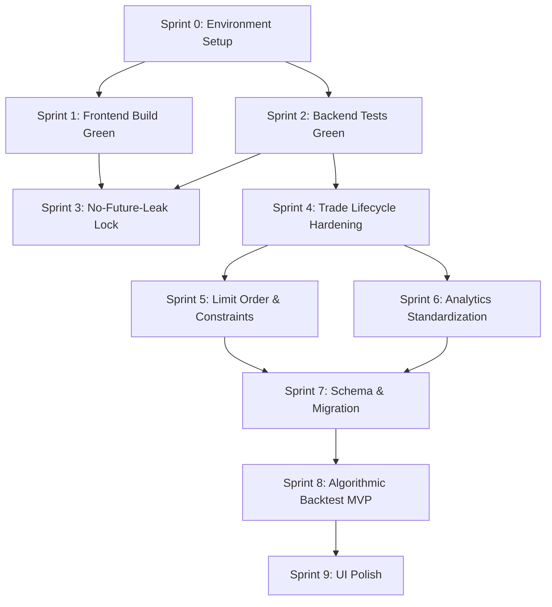

# 📋 Sumi Trading Platform – Kế Hoạch Sprint Tổng Quan

> **Ngày tạo:** 2026-06-26  
> **Dựa trên:** PROJECT_AUDIT_2026-06-26, PRODUCT_SPEC, IMPLEMENTATION_PLAYBOOK, DECISIONS  
> **Sprint duration:** 1 tuần / sprint  
> **Team:** Junior developers / Interns  

---

## 🎯 Mục Tiêu Tổng Thể

Biến codebase hiện tại từ trạng thái "60-70% MVP foundation" thành **sản phẩm đáng tin cậy, build/test xanh, logic đúng**, rồi mới phát triển feature mới.

> [!CAUTION]
> **KHÔNG được nhảy sprint.** Mỗi sprint phải pass Definition of Done trước khi chuyển sang sprint tiếp theo. DEV phải báo cáo bằng command output, không phải bằng lời nói.

---

## 📊 Tổng Quan Sprints

| Sprint | Tên Sprint | Mục tiêu chính | Phụ thuộc | Thời gian |
|--------|-----------|----------------|-----------|-----------|
| **Sprint 0** | Environment Setup | Môi trường dev chạy được | Không | Tuần 1 |
| **Sprint 1** | Frontend Build Green | `npm run build` pass 100% | Sprint 0 | Tuần 1-2 |
| **Sprint 2** | Backend Tests Green | `pytest` pass, T+2 đúng | Sprint 0 | Tuần 2-3 |
| **Sprint 3** | No-Future-Leak Lock | Indicator API session-scoped | Sprint 1+2 | Tuần 3-4 |
| **Sprint 4** | Trade Lifecycle Hardening | Fee/Tax/PnL đúng, result chuẩn | Sprint 2 | Tuần 4-5 |
| **Sprint 5** | Limit Order & Market Constraints | TC-004 pass, trần/sàn HOSE/HNX/UPCOM | Sprint 4 | Tuần 5-6 |
| **Sprint 6** | Analytics Standardization | Equity curve, Sharpe, MDD chuẩn tài chính | Sprint 4 | Tuần 6-7 |
| **Sprint 7** | Schema & Migration Cleanup | Alembic migration, exchange data | Sprint 5+6 | Tuần 7-8 |
| **Sprint 8** | Algorithmic Backtest MVP | Sync runner, BaseStrategy, sample SMA | Sprint 7 | Tuần 8-10 |
| **Sprint 9** | UI Polish & Integration | Responsive, dark mode, UX improvements | Sprint 8 | Tuần 10-11 |

---

## 📐 Quy Trình Bắt Buộc Cho Mỗi Task

### Trước khi code
```bash
git status --short
```
→ Ghi lại file nào đang dirty. Nếu file có thay đổi của người khác → đọc kỹ trước khi sửa.

### Sau mỗi task — Chạy kiểm tra bắt buộc

**Task frontend:**
```bash
cd frontend
npm.cmd run build
```

**Task backend:**
```bash
cd backend
.\.venv\Scripts\activate
python -m pytest -q app/tests
```

**Task full-stack:**
```bash
cd backend && python -m pytest -q app/tests
cd ../frontend && npm.cmd run build
```

### Format báo cáo task
```text
Task: [tên task]
Files changed: [danh sách file]
What changed: [mô tả ngắn]
Tests run: [lệnh đã chạy]
Result: [PASS/FAIL + output]
Known limitations: [giới hạn nếu có]
```

> [!WARNING]
> **KHÔNG được báo "done" nếu chưa chạy test/build tương ứng và paste output.**

---

## 🔗 Sơ Đồ Phụ Thuộc



---

## 📁 Danh Sách File Sprint Chi Tiết

| File | Nội dung |
|------|----------|
| [sprint_0_environment.md](./sprint_0_environment.md) | Sprint 0 — Environment Setup |
| [sprint_1_frontend_build.md](./sprint_1_frontend_build.md) | Sprint 1 — Frontend Build Green |
| [sprint_2_backend_tests.md](./sprint_2_backend_tests.md) | Sprint 2 — Backend Tests Green |
| [sprint_3_no_future_leak.md](./sprint_3_no_future_leak.md) | Sprint 3 — No-Future-Leak Lock |
| [sprint_4_trade_lifecycle.md](./sprint_4_trade_lifecycle.md) | Sprint 4 — Trade Lifecycle Hardening |
| [sprint_5_limit_order.md](./sprint_5_limit_order.md) | Sprint 5 — Limit Order & Market Constraints |
| [sprint_6_analytics.md](./sprint_6_analytics.md) | Sprint 6 — Analytics Standardization |
| [sprint_7_schema_migration.md](./sprint_7_schema_migration.md) | Sprint 7 — Schema & Migration Cleanup |
| [sprint_8_backtest_engine.md](./sprint_8_backtest_engine.md) | Sprint 8 — Algorithmic Backtest Engine MVP |

---

## ⚡ Quy Tắc Không Được Phá

1. **Không thêm feature mới khi build/test đang đỏ**
2. **Không sửa lung tung ngoài phạm vi task**
3. **Không tin "chạy được trên máy em" nếu không có command output**
4. **Không nhảy phase khi phase trước chưa pass DoD**
5. **Business logic không được nằm trong route handler**
6. **Database access phải qua service, không viết query trong route**
7. **Không leak future candle/indicator data trong replay mode**
8. **Type hints bắt buộc ở mọi function Python**
9. **TypeScript strict mode cho frontend**
10. **Mỗi task phải có test nếu là business logic**
