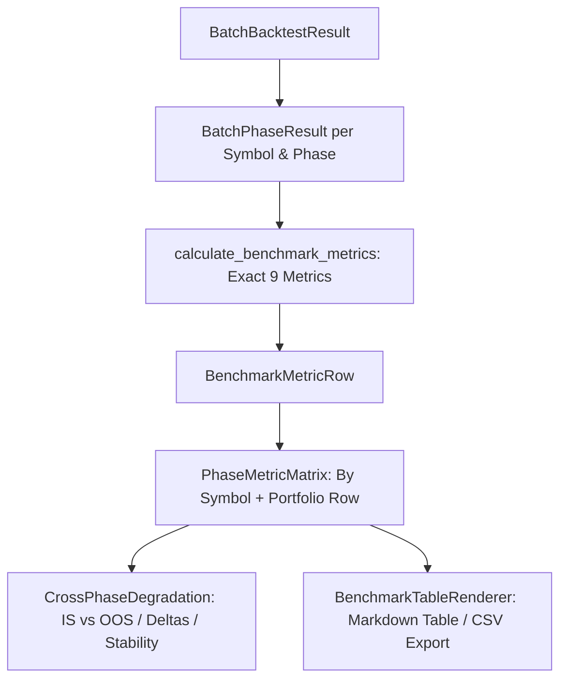

# P4-MET-02 — Phase Metric Matrix & Cross-Phase Degradation

## Outcome
A pure, deterministic benchmark metric and reporting subsystem for multi-symbol, multi-phase backtests that:
1. Calculates the exact Master 9 benchmark metrics (`Ticker`, `Net Profit`, `% Net Profit`, `# Trades`, `Avg % Profit/Loss`, `Avg Bars Held`, `% of Winners`, `W. Avg % Profit`, `L. Avg % Loss`) from closed trades in the authoritative in-memory ledger (`BacktestLedger`).
2. Implements the Master break-even winner convention (`return_pct >= 0`), preserves negative loss signs, and handles edge cases (`0 trades`, `0 winners`, `0 losers`) with explicit `None` values and `"N/A"` presentation semantics (`FR-CORE-010`, `TEST-MET-001`, `TEST-MET-002`).
3. Assembles a 2D `PhaseMetricMatrix` (Symbol $\times$ Phase + Portfolio total).
4. Quantifies `CrossPhaseDegradation` (performance deltas, degradation ratios, consistency scores between In-Sample and Out-of-Sample phases).
5. Provides `BenchmarkTableRenderer` producing the exact Master Markdown table and standardized CSV export.

## Context and problem
`P4-BATCH-01` delivered compute-once execution and independent capital simulation across multiple symbols and phases. However, the simulation outputs were aggregated only at a high level. Master Spec Section 22 and 25 mandate exact 9 benchmark columns with specific calculation signs, break-even winner classification (`return_pct >= 0`), explicit `N/A` handling, and cross-phase evaluation.

## In scope
- `backend/app/domain/backtest/metrics.py`:
  - `BenchmarkMetricRow`: 9 benchmark metrics + phase metadata.
  - `calculate_benchmark_metrics`: pure calculation without intermediate rounding.
  - `PhaseMetricMatrix`: 2D matrix structure by symbol and phase with aggregate portfolio row.
  - `CrossPhaseDegradation`: delta and ratio comparisons between adjacent and IS/OOS phases.
  - `BenchmarkTableRenderer`: Markdown table rendering and deterministic CSV export.
- `backend/app/domain/backtest/batch_runner.py`:
  - Attach benchmark metrics to `BatchPhaseResult` and `BatchBacktestResult`.
- `backend/app/schemas/backtest_schema.py`:
  - Pydantic models for metric row, matrix, and cross-phase degradation.
- `backend/app/tests/test_benchmark_metrics.py`:
  - Test suite covering `TEST-MET-001`, `TEST-MET-002`, degradation calculations, and export formatting.

## Out of scope
- Modifying signal semantics, indicator calculations, or market execution kernels.
- Database schema changes or mutations to `backend/sumi.db`.
- Frontend visual chart rendering (deferred to `P9-UI-01`).

## Invariants
- **No Future Leak**: Metrics strictly consume closed trades produced by the causal Next-Event execution kernel.
- **Break-Even Winner Convention**: `return_pct >= 0` counts as a winner.
- **Negative Sign Preservation**: Losses retain negative values (e.g. `-5.2%`).
- **Phase-End Holding Exclusion**: Open positions at phase end are never counted as closed trades (`TEST-BT-005`).
- **Presentation-Only Rounding**: Raw data structures contain unrounded IEEE 754 floats; rounding occurs only at render time.
- **No DB Mutation**: Temporary databases only for tests.

## Current architecture
- `BatchBacktestRunner` executes Next-Event simulations for each `(symbol, phase)` pair and returns `BatchBacktestResult` containing `BatchPhaseResult` items.
- Each `BatchPhaseResult` holds the raw `BacktestKernelResult` with its `BacktestLedger` and closed `trades`.

## Target design


## Milestones
1. [x] **Milestone 1**: Implement `backend/app/domain/backtest/metrics.py` with `BenchmarkMetricRow`, `calculate_benchmark_metrics`, `PhaseMetricMatrix`, `CrossPhaseDegradation`, and `BenchmarkTableRenderer`.
2. [x] **Milestone 2**: Update `backend/app/schemas/backtest_schema.py`, `backend/app/domain/backtest/batch_runner.py`, and `backend/app/api/backtest.py` to integrate metric matrices and degradation outputs.
3. [x] **Milestone 3**: Write comprehensive test suite `backend/app/tests/test_benchmark_metrics.py` verifying `TEST-MET-001`, `TEST-MET-002`, edge cases, and degradation calculations.
4. [x] **Milestone 4**: Run full verification gates (`verify-v2.ps1` and `run-comprehensive-uat.ps1`).
5. [x] **Milestone 5**: Obtain independent review, seal `docs/reviews/P4_MET_02_REVIEW.md`, and advance `docs/dev-program/STATE.json`.

## Acceptance mapping
| Acceptance ID | Implementation evidence | Test/UAT evidence | Status |
| --- | --- | --- | --- |
| `FR-CORE-010` | `metrics.py::calculate_benchmark_metrics` | `test_benchmark_metrics.py::test_golden_trade_ledger_exact_nine_metrics` | **PASS** |
| `TEST-MET-001` | `metrics.py::BenchmarkMetricRow` | `test_benchmark_metrics.py::test_golden_trade_ledger_exact_nine_metrics` | **PASS** |
| `TEST-MET-002` | `metrics.py` N/A edge handling | `test_benchmark_metrics.py::test_edge_cases_zero_trades` | **PASS** |
| Break-even winner | `metrics.py` `return_pct >= 0` | `test_benchmark_metrics.py::test_break_even_convention` | **PASS** |
| Cross-phase degradation | `metrics.py::compare_phases` | `test_benchmark_metrics.py::test_compare_phases_degradation_calculation` | **PASS** |
| Master Section 25 table | `metrics.py::BenchmarkTableRenderer` | `test_benchmark_metrics.py::test_benchmark_table_renderer_markdown` | **PASS** |

## Verification commands
```powershell
# 1. Focused benchmark metrics tests
pytest backend/app/tests/test_benchmark_metrics.py backend/app/tests/test_batch_runner.py -v

# 2. Fast technical gate
.\scripts\verify-v2.ps1

# 3. Comprehensive browser UAT
.\scripts\run-comprehensive-uat.ps1
```

## Rollback and compatibility
`metrics.py` is a pure calculation module. If needed, the module can be removed and schema additions reverted without impacting historical data or the database schema.

## Risks and mitigations
- **Risk**: Float precision divergence in return calculations.
  - **Mitigation**: Do not round intermediate values; compute `return_pct = 100.0 * net_pnl / entry_cost` directly.
- **Risk**: Division by zero when computing degradation for zero or negative returns.
  - **Mitigation**: Safe fallbacks with explicit `None` and degradation flags.

## Progress log
- 2026-09-18: ExecPlan created.
- 2026-09-18: Implemented pure domain module `backend/app/domain/backtest/metrics.py` with Master 9 metrics, 2D matrix assembly, portfolio aggregation, degradation comparisons, and Section 25 table/CSV rendering.
- 2026-09-18: Integrated benchmark metrics into `BatchBacktestRunner` and updated `backtest_schema.py`.
- 2026-09-18: Implemented test suite `backend/app/tests/test_benchmark_metrics.py` covering golden ledger, edge cases (0 trades, 100% win/loss), break-even convention, portfolio aggregation, cross-phase degradation, and API integration (11/11 passed).
- 2026-09-18: Passed technical gate `.\scripts\verify-v2.ps1` (296 backend pytest, Alembic, frontend lint/test/build).
- 2026-09-18: Passed comprehensive browser UAT `.\scripts\run-comprehensive-uat.ps1` (31/31 passed, zero console errors, zero DB mutation).
- 2026-09-18: Sealed independent review in `docs/reviews/P4_MET_02_REVIEW.md` and advanced STATE.json.
