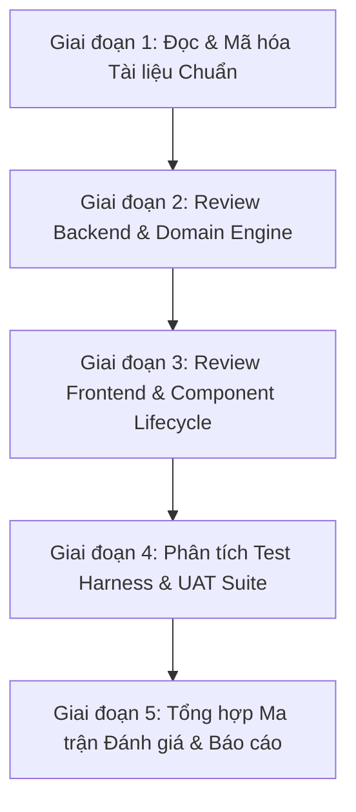

# Kế hoạch Nghiên cứu & Review Toàn diện Dự án Sumi (V3 Release Candidate)

> **Ngày lập kế hoạch:** 25/07/2026
>
> **Phạm vi tác động:** Nghiên cứu tài liệu, rà soát mã nguồn (Backend, Frontend, Test suite), đánh giá luồng nghiệp vụ.
> **Nguyên tắc cốt lõi:** Không thay đổi source code ứng dụng; toàn bộ báo cáo và kết quả review được lưu trữ tại `docs/tester/`.

---

## I. MỤC TIÊU VÀ NGUYÊN TẮC NGHIÊN CỨU

### 1. Mục tiêu
- **Hiểu chính xác 100% bức tranh hệ thống:** Nắm vững toàn bộ kiến trúc, luồng dữ liệu (data flow), nguyên tắc thiết kế và hiện trạng sản phẩm Sumi từ V2 đến V3 Release Candidate.
- **Review không bỏ sót:** Thực hiện rà soát tuần tự theo từng lớp (Documentation -> Backend Domain -> Frontend Architecture -> Test Harness & UAT).
- **Lập hồ sơ đánh giá đầy đủ:** Xuất các tài liệu phân tích chuyên sâu tại thư mục `docs/tester/` làm cơ sở tham chiếu lâu dài cho đội ngũ phát triển và kiểm thử.

### 2. Các nguyên tắc bất biến (Non-negotiable Invariants)
- **Local-first strictly:** Không gửi telemetry, không gửi dữ liệu giao dịch/thị trường của người dùng ra các service bên ngoài.
- **No-future-leak:** Dữ liệu nến Replay chỉ được trả về tính đến `current_index`; không gửi toàn bộ nến về frontend để slice.
- **Backend Source of Truth:** `IndicatorEngine` tại backend là cơ quan duy nhất chịu trách nhiệm tính toán giá trị chỉ báo chính xác.
- **DB Isolation:** Không thao tác hoặc làm biến đổi CSDL production (`backend/sumi.db`) trong quá trình chạy tự động/UAT; luôn dùng CSDL tạm thời.
- **Code Read-Only:** Không sửa đổi bất kỳ file code nào trong `backend/`, `frontend/`, hoặc `scripts/` trong suốt quá trình nghiên cứu này.

---

## II. KẾ HOẠCH THEO CÁC GIAI ĐOẠN (5-PHASE RESEARCH & REVIEW PLAN)

---

### GIAI ĐOẠN 1: ĐỌC & MÃ HÓA TÀI LIỆU CHUẨN (CANONICAL DOCS & ARCHITECTURE REVIEW)

**Thời gian dự kiến:** Bước 1 (Thực hiện ngay)
**Tập tài liệu mục tiêu:**
1. `docs/PRODUCT_V3_PLAN_2026-07-15.md` - Chiến lược rebuild Replay UI, mục tiêu V3, định hướng các Batches (0 đến 5).
2. `docs/PRODUCT_ACCEPTANCE_CRITERIA_V3.md` - Hợp đồng nghiệm thu 254+ ID (Global G-*, Replay R-*, Indicator I-*, Drawing D-*, Trading Practice T-*).
3. `docs/ARCHITECTURE_DECISION_001_REPLAY_UI_REBUILD.md` - Quyết định ADR-001 về việc xây dựng lại Replay UI & phân định ranh giới adapter.
4. `docs/DEVELOPMENT_OPERATING_MODEL.md` - Quy trình làm việc giữa Reviewer và DEV task, nguyên tắc quản lý làm việc theo Batch.
5. `docs/PROJECT_REVIEW_REPORT_2026-07-15.md` - Báo cáo đánh giá hiện trạng dự án trước V3.
6. `docs/V3_RELEASE_CANDIDATE_NOTES.md` - Báo cáo tổng kết nghiệm thu Batch 5 và bằng chứng sealed evidence.
7. `AGENTS.md` & `PLANS.md` - Các quy định và chuẩn đóng gói ExecPlan.

**Đầu ra Giai đoạn 1:**
📄 File `docs/tester/01_ARCHITECTURE_AND_DOCS_SUMMARY.md` tổng hợp bức tranh tổng quan kiến trúc, danh mục nghiệm thu và các quy tắc nghiệp vụ cốt lõi.

---

### GIAI ĐOẠN 2: REVIEW KIẾN TRÚC BACKEND & DOMAIN ENGINE

**Mục tiêu:** Rà soát mã nguồn Backend (`backend/app/`) để nắm chắc cách thức xử lý dữ liệu nến, tính toán indicator, mô phỏng khớp lệnh, quản lý phiên và xử lý giao dịch.

**Chi tiết phạm vi review:**
1. **Lớp Domain Engine (`backend/app/domain/`):**
   - `engine/indicator_engine.py`: Các công thức tính toán SMA, EMA, MACD, RSI, BB, ATR, ADX, Ichimoku, Stochastic, CCI (bao gồm việc ghi đè lỗi của `pandas-ta`).
   - `engine/strategy_indicator_adapter.py`: Khớp nối dữ liệu indicator giữa Replay API và Backtest Engine.
   - `domain/strategy/strategy_rule_evaluator.py`: Bộ đánh giá luật chiến lược dùng chung cho cả Backtest và Scanner.
   - `domain/accounting.py` & `market_rules.py`: Quy tắc khớp lệnh T+2, tính toán số dư, vị thế, margin, PnL.
2. **Lớp Services (`backend/app/services/`):**
   - `replay_service.py`: Luồng lấy nến không rò rỉ tương lai (`no-future-leak`), tua nến, chuyển trạng thái index.
   - `practice_workflow_service.py` & `journal_service.py`: Quản lý nhật ký thực hành, ghi chép quyết định trading.
   - `trade_lifecycle_service.py`: Vòng đời lệnh (Pending, Filled, Cancelled), vị thế giao dịch.
   - `backtest_service.py` & `backtest_cleanup_service.py`: Thực thi backtest khai báo (declarative) và dọn dẹp phiên rác.
   - `scanner_service.py` & `strategy_lab_service.py`: Quản lý quét tín hiệu lịch sử và so sánh tham số chiến lược.
3. **Lớp API & Database (`backend/app/api/`, `models/`, `schemas/`):**
   - Rà soát các endpoint FastAPI: `/api/replay`, `/api/backtest`, `/api/scanner`, `/api/indicators`, `/api/strategy-lab`.
   - Kiểm tra sơ đồ cơ sở dữ liệu SQLAlchemy và Alembic migrations.

**Đầu ra Giai đoạn 2:**
📄 File `docs/tester/02_BACKEND_ARCHITECTURE_AND_CODE_REVIEW.md` đánh giá chi tiết Backend.

---

### GIAI ĐOẠN 3: REVIEW KIẾN TRÚC FRONTEND & COMPONENT LIFECYCLE

**Mục tiêu:** Phân tích mã nguồn Frontend (`frontend/src/`) theo định hướng ADR-001 (khởi tạo Replay Workspace facade, Lightweight Charts v5 integration, Drawing Provider và Indicator Manager).

**Chi tiết phạm vi review:**
1. **Kiến trúc Replay Workspace Core (`frontend/src/components/replay/`):**
   - `ReplayWorkspace.tsx` & `ReplayWorkspaceController.tsx`: Tách biệt giữa giao diện hiển thị và quản lý state ứng dụng.
   - `PracticeRail.tsx` & `PracticeJournal.tsx`: Khung điều khiển giao dịch, ghi nhật ký, kiểm tra checklist.
2. **Thư viện & Quản lý Biểu đồ (`frontend/src/components/chart/`):**
   - `CandleChart.tsx`: Facade kết nối với Lightweight Charts v5.2.
   - `PaneManager.ts` & `SeriesManager.ts`: Quản lý phân vùng (price, volume, oscillators) và đồng bộ trục thời gian.
   - `IndicatorManager.tsx` & `IndicatorPaneChrome.tsx`: Giao diện quản lý/thêm/sửa/ẩn chỉ báo.
   - `DrawingInspector.tsx`: Bảng điều khiển thuộc tính công cụ vẽ.
3. **Lớp Chức năng & Domain Logic (`frontend/src/features/`):**
   - `drawings/`: `DrawingProvider.ts`, `SumiPrimitiveDrawingProvider.ts`, `drawingGeometry.ts`, `drawingMagnet.ts` (xử lý vẽ nến, điểm neo, snap nam châm, undo/redo).
   - `indicators/`: `IndicatorRepository.ts`, `IndicatorRequestCoordinator.ts` (quản lý request chỉ báo, tránh duplicate/race condition).
   - `practice/` & `replay/`: `globalShortcutPolicy.ts` (phim tắt không gây xung đột khi gõ chữ trong modal/journal).

**Đầu ra Giai đoạn 3:**
📄 File `docs/tester/03_FRONTEND_ARCHITECTURE_AND_CODE_REVIEW.md` đánh giá chi tiết Frontend.

---

### GIAI ĐOẠN 4: PHÂN TÍCH QUY TRÌNH KIỂM THỬ (TEST HARNESS & UAT SUITE)

**Mục tiêu:** Khảo sát toàn bộ hệ thống test tự động để đảm bảo hiểu cách dự án tự chứng minh chất lượng sản phẩm.

**Chi tiết phạm vi review:**
1. **Backend Test Suite (`backend/app/tests/`):**
   - Phân tích các file test quan trọng: `test_trade_lifecycle.py`, `test_accounting.py`, `test_indicator_parity_e2e.py`, `test_practice_workflow.py`, `test_backtest_cleanup.py`.
2. **Frontend Unit/Integration Tests (`frontend/src/**/__tests__/`):**
   - Rà soát các bộ test cho `SumiPrimitiveDrawingProvider`, `IndicatorRequestCoordinator`, `PaneManager`, `SeriesManager`, `PracticeWorkflow`.
3. **Hệ thống Product UAT tự động hóa (`scripts/`):**
   - Phân tích `scripts/product-uat.mjs`, `scripts/run-product-uat.sh`, `scripts/verify-product.sh`.
   - Tìm hiểu cơ chế chụp ảnh màn hình 1440x1000, kiểm tra lỗi console/page error, và kiểm tra bằng chứng sealed evidence tại `test-results/`.

**Đầu ra Giai đoạn 4:**
📄 File `docs/tester/04_TESTING_AND_UAT_SUITE_ANALYSIS.md` phân tích toàn bộ bộ test.

---

### GIAI ĐOẠN 5: TỔNG HỢP MA TRẬN ĐÁNH GIÁ & BÁO CÁO TỔNG KẾT

**Mục tiêu:** Tổng hợp toàn bộ phát hiện, kiểm tra mức độ đáp ứng của hệ thống so với tập tiêu chuẩn `PRODUCT_ACCEPTANCE_CRITERIA_V3.md`.

**Đầu ra Giai đoạn 5:**
📄 File `docs/tester/05_SUMI_V3_FINAL_COMPREHENSIVE_REVIEW.md` chứa:
- Đánh giá mức độ hoàn thiện của từng nhóm tính năng (Replay, Indicator, Drawing, Practice Workflow, Backtest/Scanner).
- Kết luận về tính ổn định, hiệu năng, kiến trúc và độ tin cậy của Sumi V3 Release Candidate.

---

## III. DỰ KIẾN TÀI LIỆU KẾT QUẢ TẠI `docs/tester/`

Sau khi hoàn thành kế hoạch nghiên cứu, thư mục `docs/tester/` sẽ bao gồm các tài liệu sau:

| STT | Tên tài liệu | Nội dung chính |
| :--- | :--- | :--- |
| 1 | `SUMI_PROJECT_RESEARCH_AND_REVIEW_PLAN.md` | Tài liệu kế hoạch tổng thể (File hiện tại). |
| 2 | `01_ARCHITECTURE_AND_DOCS_SUMMARY.md` | Tóm tắt các tài liệu chuẩn, mục tiêu V3 và ranh giới hệ thống. |
| 3 | `02_BACKEND_ARCHITECTURE_AND_CODE_REVIEW.md` | Báo cáo rà soát kiến trúcBackend, Domain Engine và Services. |
| 4 | `03_FRONTEND_ARCHITECTURE_AND_CODE_REVIEW.md` | Báo cáo rà soát Frontend, Replay Workspace, Charting & Drawing Subsystem. |
| 5 | `04_TESTING_AND_UAT_SUITE_ANALYSIS.md` | Phân tích quy trình test tự động, Pytest, Frontend test và Product UAT script. |
| 6 | `05_SUMI_V3_FINAL_COMPREHENSIVE_REVIEW.md` | Báo cáo tổng hợp đánh giá chất lượng toàn diện Sumi V3 RC. |

---

## IV. BẮT ĐẦU THỰC HIỆN GIAI ĐOẠN 1

Tôi sẽ bắt đầu triển khai **Giai đoạn 1: Đọc & Mã hóa Tài liệu Chuẩn** ngay lập tức để trích xuất các thông tin cốt lõi nhất của dự án Sumi V3.
